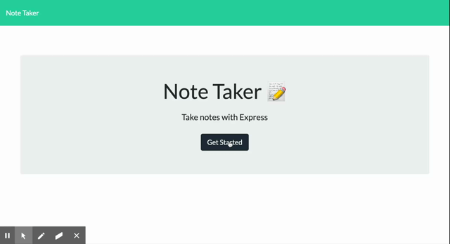

# note_taking

## Table of Contents

1. [Developers Comment](#Developer-Comment)
1. [User Story](#User-Story)
1. [Acceptance Criteria](#Acceptance-Criteria)
1. [Languages](#Languages)
1. [Demo](#Demo)
1. [Links](#Links)
1. [Installation](#Installation)

## Developer Comment

This homework assignment made me really grind my gears. I was able to get it to work eventually after figuring out all my pathing issues. The routes themselves were not hard to set up, but the reading JSON data functions were definitely not fun. 

## User Story

```
AS A user, I want to be able to write and save notes

I WANT to be able to delete notes I've written before

SO THAT I can organize my thoughts and keep track of tasks I need to complete
```

## Acceptane Criteria

```
Application should allow users to create and save notes.

Application should allow users to view previously saved notes.

Application should allow users to delete previously saved notes.
```

## Demo



## Links

Repository: https://github.com/Bejarano03/note_taking

Heroku: 

## Installation

- Fork repository
- Open in editor of choice
- Run "npm i" in the console to install dependencies. 
